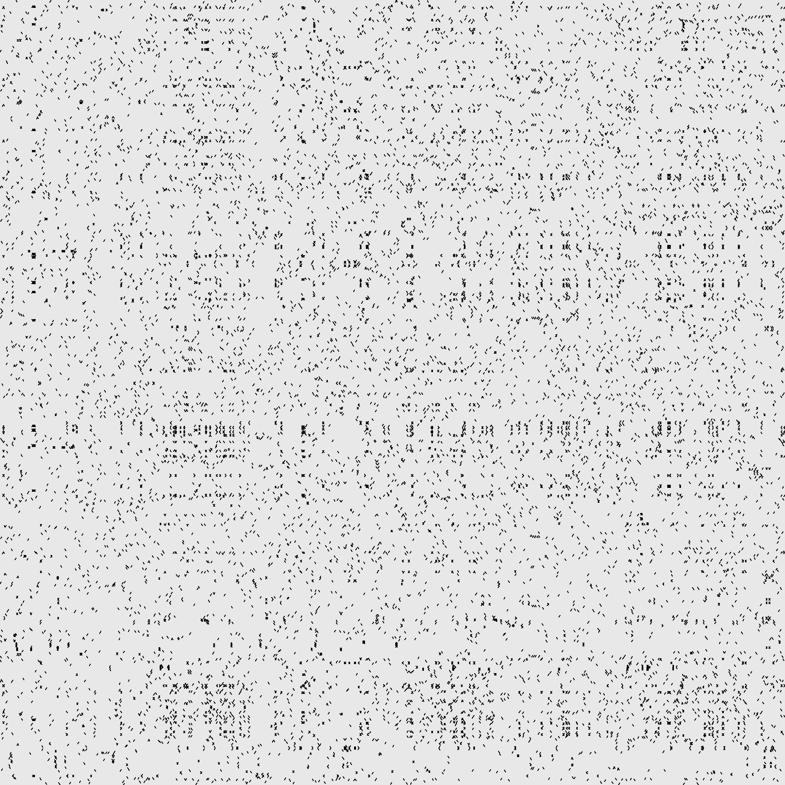

### Dotplot Generator
A small, fast program and API to generate a dotplot




## Standalone
To generate a dotplot from the command line, enter
`genplot SEQUENCE1 SEQUENCE2 OUTPUT.PNG`
where SEQUENCE1 is any string, SEQUENCE2 is the string to compare it against, and OUTPUT.PNG is the file the image is written to.
Note that genplot filters to 5mers by default.

### options
  * -n <int>: number of bases to use as a minimum for the filter (default: 5)
  * -w <int>: maximum width (in pixels) of image to generate (default: 2000)
  * -h <int>: maximum height (in pixels) of image to generate (default: 2000)

## API
### Creating the dotplot

```c
char *seq1 = "ACCGATCGTATCG";
char *seq2 = "ACCTAGTCTAG";
dotplot *dp = create_dotplot(seq1, seq2);
```

### Filtering the dotplot

```c
int minMatchLength = 5; // remove any matches that are not at least 5 contiguous bases (gaps not allowed)
dotplot *filtered = filter_dotplot(dp, minMatchLength); // create a new dotplot with the filter applied
```

### Rendering the dotplot

```c

gdImagePtr image = render_dotplot(filtered, 200, 200); // create an image with a maximum size of 200x200px. If your x and y sequences have fewer than 200 bases, their size will be used instead for 1base/px

// you will now have an image you can write to a file
```

